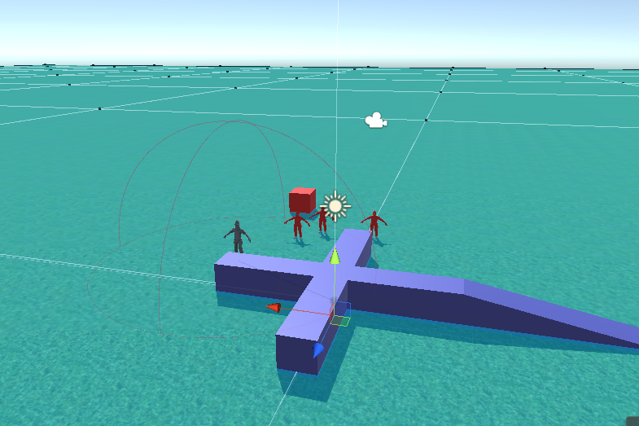

# Cthulhu

Cthulhu is a RPG game, and implement with unity.

---
---

## Descrpition

 - Game type: RPG, 3D
 - Platform: Unity3D

---
---

## Background
The Background story of this game is based on the [The Call of Cthulhu](https://en.wikipedia.org/wiki/The_Call_of_Cthulhu), which is a short story by American writer [H. P. Lovecraft](https://en.wikipedia.org/wiki/H._P._Lovecraft).
### 

Main character prototype based on Francis Wayland Thurston who is the a character in [The Call of Cthulhu](https://en.wikipedia.org/wiki/The_Call_of_Cthulhu).

---
---

## Character Setting
### 
### 

---
---

## Current stage
 - Player movement Complete
 - User interface Complete
 - Environment
  -  making WindMill rotating Complete
  - 
 - Enemy [Path Finding](https://en.wikipedia.org/wiki/Pathfinding) Complete
 - 
 - Fully Event Based [Raycasting](https://en.wikipedia.org/wiki/Ray_casting)


---
---

## Coding Information
#### 1. About WindMill rotating
## 
Based on the code below in file [SpinMe.cs](https://github.com/DaBaiHao/Cthulhu/blob/master/Cthulhu/Assets/Utility/SpinMe.cs) :

``` C
float xDegreesPerFrame = Time.deltaTime / 60 * 360 * xRotationsPerMinute;
transform.RotateAround(transform.position, transform.right, xDegreesPerFrame);
float yDegreesPerFrame = Time.deltaTime / 60 * 360 * yRotationsPerMinute;
transform.RotateAround(transform.position, transform.up, yDegreesPerFrame);
float zDegreesPerFrame = Time.deltaTime / 60 * 360 * zRotationsPerMinute;
transform.RotateAround(transform.position, transform.forward, zDegreesPerFrame);
```

---
#### 2. About Enemy [Path finding](https://en.wikipedia.org/wiki/Pathfinding)
## 
1. Using [Nevigation and PathFinding( AI tool )](https://docs.unity3d.com/Manual/Navigation.html) in Unity to find walkable ground in the environment item.
## 
## 

2. Add [nav mesh agent](https://docs.unity3d.com/ScriptReference/AI.NavMeshAgent.html) and [AI character control](https://answers.unity.com/questions/139191/make-ai-move-using-charactercontrollermove-instead.html) functions
3. using the [nav mesh agent](https://docs.unity3d.com/ScriptReference/AI.NavMeshAgent.html) and [AI character control](https://answers.unity.com/questions/139191/make-ai-move-using-charactercontrollermove-instead.html) functions in  [Enemy.cs](https://github.com/DaBaiHao/Cthulhu/blob/master/Cthulhu/Assets/Scenes/Enemy/Enemy.cs):

``` C
if(distanceToPlayer <= attackRadius)
      {
           aiCharacterControl.SetTarget(player.transform);
       }
       else
       {
           aiCharacterControl.SetTarget(transform);
       }

```
The enemy will stop when player character run away.
## 

---
#### 3. Fully Event Based [Raycasting](https://en.wikipedia.org/wiki/Ray_casting)
#### 4. Player [Path finding](https://en.wikipedia.org/wiki/Pathfinding)
1. Using [Nevigation and PathFinding( AI tool )](https://docs.unity3d.com/Manual/Navigation.html) in Unity to find walkable ground in the environment item.
2. using the [nav mesh agent](https://docs.unity3d.com/ScriptReference/AI.NavMeshAgent.html) and [AI character control](https://answers.unity.com/questions/139191/make-ai-move-using-charactercontrollermove-instead.html) functions in  [PlayerMovement.cs](https://github.com/DaBaiHao/Cthulhu/blob/master/Cthulhu/Assets/Scenes/Player/PlayerMovement.cs):

``` C
switch (layerHit)
        {
            case enemyLayerNumber:
                // navigate to the enemy
                GameObject enemy = raycastHit.collider.gameObject;
                aiCharacterControl.SetTarget(enemy.transform);
                break;
            case walkableLayerNumber:
                // navigate to point on the ground
                walkTarget.transform.position = raycastHit.point;
                aiCharacterControl.SetTarget(walkTarget.transform);
                break;
            default:
                Debug.LogWarning("Don't know how to handle mouse click for player movement");
                return;
        }

```

3. The player will find the enemy after click the target one:  
## 
